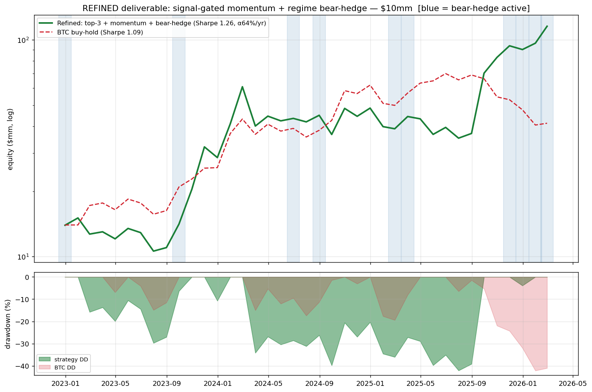
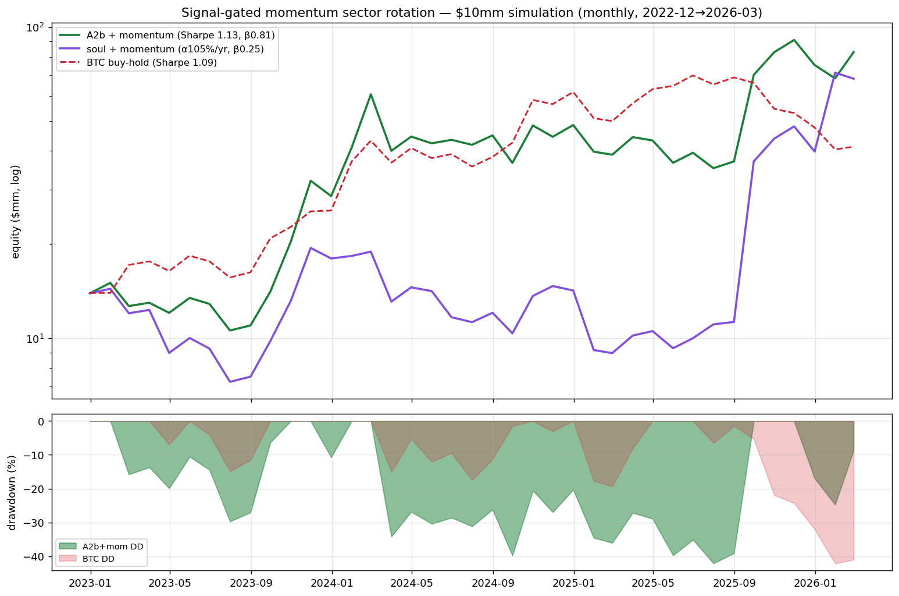
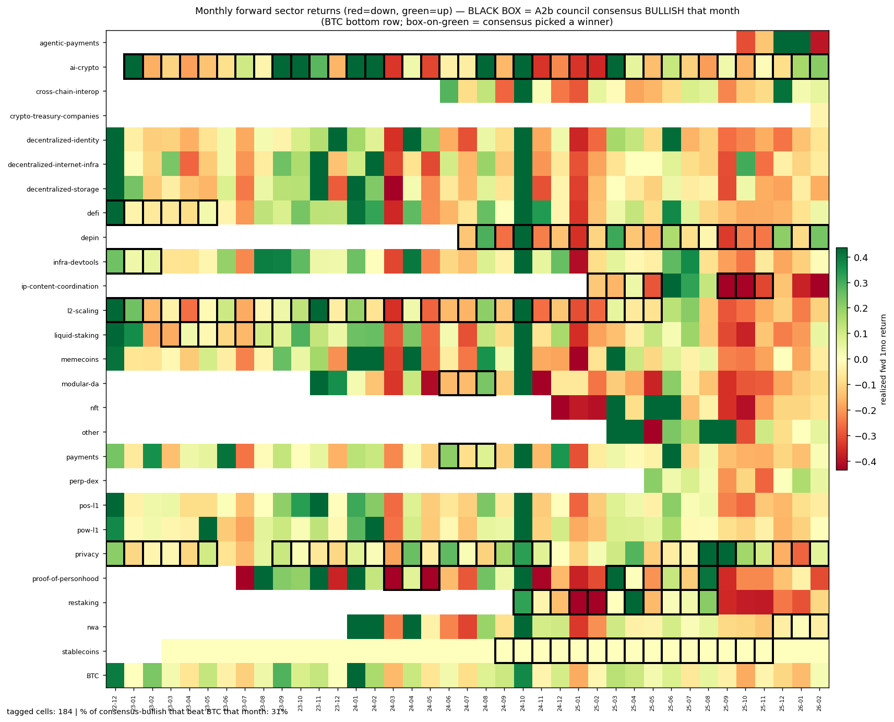

# Turning a16z's Crypto Corpus into a Trading Strategy

*A case study in structuring unstructured data, extracting a signal, and building a tradeable mechanism around it.*

---

## The question

Can the public writing and speech of the a16z crypto team — years of tweets, essays, and podcast
transcripts — be turned into a structured, tradeable signal? Not "is it a money printer," but: **can we
add structure to unstructured data, extract a real signal from it, and build an honest trading mechanism?**

The deliverable is the **pipeline and an honest characterization of what it can and can't do** — not an
overfit Sharpe ratio.

## How it works (the pipeline)

```
a16z corpus (tweets + essays + transcripts, timestamped)
      │   every step is "as of date T" — the model never sees the future (lookahead firewall)
      ▼
Extract each team member's market view at T  ──►  excited/concerned sectors & tokens, conviction, horizon
      ▼
Combine the members into one house view      ──►  consensus or council deliberation
      ▼
Map to a tradeable universe                   ──►  ~100 liquid tokens (Coinglass), sector baskets, BTC beta
      ▼
Backtest with walk-forward validation         ──►  monthly rebalance, $10mm, realistic costs & capacity
```

We built **four ways** to turn the corpus into a house view, increasing in sophistication:

| | Approach | What it does |
|---|---|---|
| **A1** | Blended | Read the whole corpus at once → one house view |
| **A2** | Per-member | Extract each member's view, then combine — by **consensus (A2a)** or **council deliberation (A2b)** |
| **A3** | Market-aware | A2 views **+ a live market/news digest** → members react to what's happening |
| **A4** | Doppelganger | Each member's **"soul"** (how they reason, built from their full corpus) + memory + digest → reasons in character |

### The headline finding: more machinery did *not* help

**A2b — per-member views combined through council deliberation — won.** It produced the strongest,
cleanest signal (cross-sectional information coefficient t = 2.42, p = 0.016). Feeding members live market
data (A3) or modeling each member's reasoning style (A4, the most expensive build) **did not beat it** —
the extra machinery mostly added noise. The council deliberation over plain extracted views was the sweet
spot: sophisticated enough to capture disagreement between members, simple enough not to inject noise. It's
also the *cheapest* of the sophisticated approaches to run.

## The strategy

**Signal-gated momentum sector rotation with a regime bear-hedge.** Monthly, $10mm. Each month:

1. **Signal** — take the a16z council's (A2b) *bullish sector* calls, ranked by conviction.
2. **Momentum gate** — keep only sectors whose basket has **≥10% trailing-1-month return** (the theme is
   actually moving, not just thematically favored).
3. **Select** — go long the **top 3** that pass, equal-weighting their liquid token baskets. If none pass,
   **hold BTC**.
4. **Regime hedge** — if BTC's trailing-3-month return is **below −10% (a bear regime)**, beta-neutralize
   the book; otherwise stay long.

**Why each piece:** the corpus picks *which themes* (it's a sector selector, not a token picker); momentum
picks *when* they're live (themes sit dead for years then spike — Zcash was flat for 3 years then ran
+444% in two months); the BTC fallback avoids forcing trades in quiet months; the bear-hedge only fires
when it actually helps (hedging hurts in bull and sideways markets, helps in bear).

## Results

**Refined strategy: $10mm → $116mm. Sharpe 1.26 (BTC 1.09), alpha +64%/yr, max drawdown −42%.**


*Green = the strategy, red dashed = BTC buy-hold. Blue bands = months the bear-hedge was active. Bottom
panel = drawdowns.*

### How the two signal "flavors" compare


*A2b + momentum (green) is the higher-Sharpe book; the soul-based A4 + momentum (purple) is a lower-beta,
higher-alpha but lumpier book.*

### Did the council's picks land on the winners?


*Each cell = a sector's realized return that month (red down, green up); BTC is the bottom row. Black boxes
mark the months the council was bullish on that sector. The strategy's edge is the momentum gate filtering
these calls down to the ones that are working.*

## Validation (how we kept ourselves honest)

- **Walk-forward validation** — parameters chosen only on past data, applied forward. The strategy returned
  **+354% out-of-sample vs BTC's +61%** over 27 truly out-of-sample months, and the walk-forward picked the
  *same* parameters the full-sample optimization did → stable, not overfit.
- **Regime-hedge robustness** — the bear-hedge improves results across *every* threshold from −5% to −25%,
  so it's a structural effect, not a fitted spike.
- **Capacity realism** — under the realistic execution limit (max 5% of a token's daily open interest), the
  edge **survives at $10mm** (+911% vs +1057% uncapped) but fades by $100mm. **This is a small-AUM strategy.**
- **Attribution** — about half the P&L is just BTC beta (the fallback months); the real alpha comes from
  **two early theme calls — privacy and AI — that the council made years before they paid off.**

## The honest caveats

- **Not formally significant.** With only ~39 months of data, the best alpha t-stat is ≈1.2–1.45 — promising
  but short of statistical proof. The signal's *cross-sectional* information is significant; the *portfolio*
  alpha isn't yet, because 39 monthly returns is a small sample dominated by market beta.
- **The edge rests on a few early theme bets.** That's consistent with a VC-style power-law (a couple of
  big winners carry the book), but it means the open question is: *does the council reliably find the **next**
  privacy/AI early?* An out-of-sample test on the 2021–2022 cycle (including the bear market) is the way to
  answer that.
- **Sector, not token.** The council knows which *themes* to back; trading its specific *token* picks loses
  money (−17%/yr alpha). The sector basket's diversification across a theme is where the edge lives.

## Reproduce

```bash
python -m venv .venv && . .venv/bin/activate
pip install -r scrapers/a16z_research/requirements.txt

python -m scripts.strategy_final     # the deliverable strategy + tearsheet
python -m scripts.wfv                 # walk-forward validation
python -m scripts.regime_analysis     # performance by market regime
python -m scripts.capacity            # capacity / execution realism
python -m scripts.sim_chart           # equity-curve charts
python -m scripts.sector_chart        # sector-returns heatmap
```

Full research log (24 findings, chronological): see the lab vault
`vault/knowledge/2026-06-09-sentience-signal-findings.md` and the executive summary
`vault/knowledge/2026-06-10-sentience-case-study-summary.md`.

---

*Built end-to-end with point-in-time lookahead firewalls throughout; ~340 unit tests. Branch
`signal/corpus-strategy`.*
